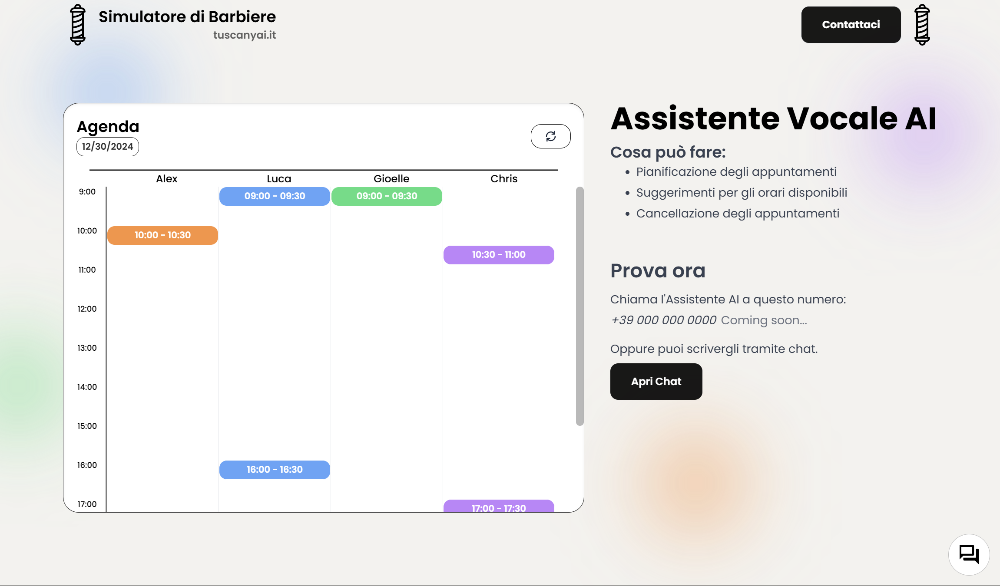
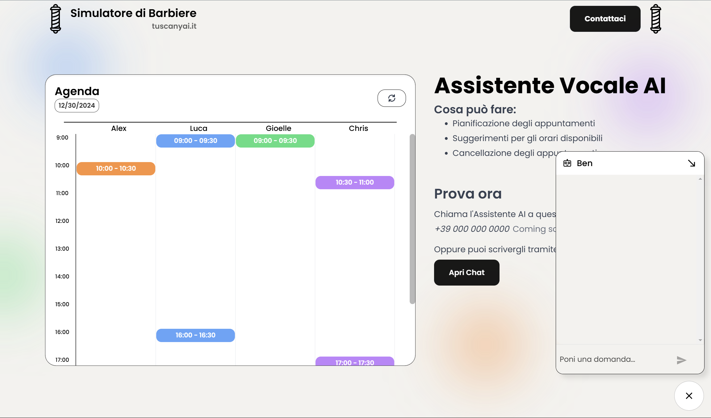

# TuscanyAI Frontend

This repository contains the **frontend** for the **TuscanyAI** website, where users can interact with **Ben**, an AI Voice Assistant, designed to manage barbershop appointments seamlessly.

## About

The frontend is responsible for creating an intuitive and user-friendly interface that allows users to:

- **Chat with Ben**: Users can schedule or cancel barbershop appointments via the integrated chat.
- **View the Agenda**: Barbers and clients can see the updated daily schedule, showing all appointments in a clean, color-coded layout.

The frontend is built to seamlessly communicate with the backend, ensuring real-time updates and a smooth experience.

## Key Features

- **Interactive Chat Interface**: Engage with Ben through a modern and responsive chat system integrated into the website.
- **Agenda View**: Display a clear schedule of appointments with time slots, client names, and status indicators.
- **Responsive Design**: Optimized for all devices, including desktops, tablets, and mobile phones.

## Screenshots

### Agenda View

### Chat Interface

## Technologies Used

- **React.js**: Frontend library for building the user interface.
- **Tailwind CSS**: For styling and responsive design.
- **Nginx**: Used to serve the application in production.

## Learn More

Visit the live website to see the frontend in action: [https://tuscanyai.it](https://tuscanyai.it)

---

Stay tuned for updates and new features. Contributions are welcome to improve the project!
